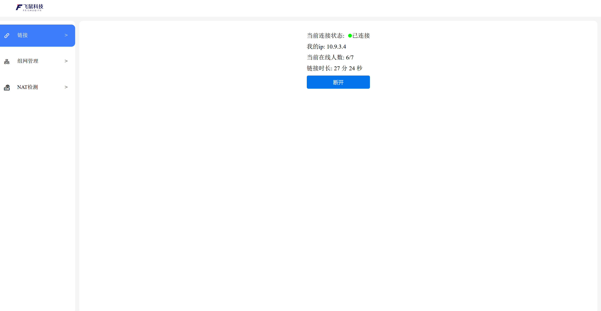

# Compose方式部署NAT打洞客户端

| 作用       | 类型 | 协议        | 备注                               |
| ---------- | ---- | ----------- | ---------------------------------- |
| api访问    | tcp  |        |                        |

## 适用于nas，路由器，arm设备，不适合直接运行在win,macos中
## 一键脚本安装
需要提前安装docker、docker-compose;
```bash
# 执行安装docker
curl -fsSL https://dow.feishunet.com/get-docker.sh -o get-docker.sh
sh get-docker.sh --mirror Aliyun
# 下载运行compose以及脚本
wget https://dow.feishunet.com/p2p/docker-compose.yaml
wget https://dow.feishunet.com/p2p/st.sh
# 一键运行
bash st.sh
```

## 通过浏览器访问
* ip地址+port:9091  

### 类似如下地址
`http://192.168.3.104:9091`
* 默认无密码需要打开网页去单独设置密码
### 网页如下


## 相关可能用到的参数
### 查看连接状态
> 执行结果命令查看和其他客户端通信状态
`docker logs p2p-feishu-1 | grep curl`
`curl localhost:9091/p2p | jq`
### 查看日志
`docker logs -f p2p-feishu-1`
### 进入容器
`docker exec -it p2p-feishu-1 sh`