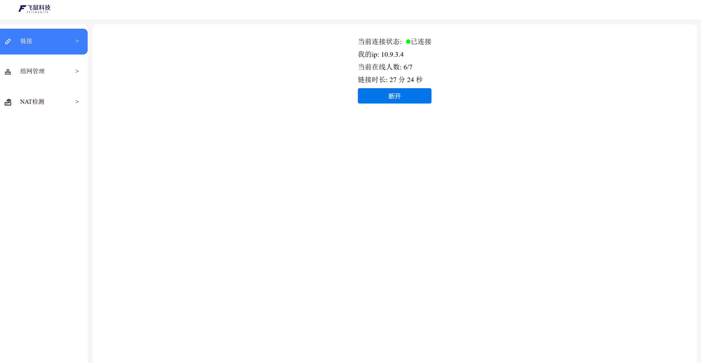

# docker一键启动方式
## 创建文件夹
* `mkdir p2p`
## `执行如下命令启动`
```bash
docker run -d \
  --name feishu-p2p \
  --cap-add=ALL \
  --privileged=true \
  -v $(pwd)/conf:/data/conf/ \
  -v $(pwd)/logs:/data/logs/ \
  --device=/dev/net/tun \
  --restart=always \
  --network=host \
  registry.cn-qingdao.aliyuncs.com/feishuwg/p2p:v2.2
```
## 通过浏览器访问
* ip地址+port:9091  

### 类似如下地址
`http://192.168.3.104:9091`
* 默认无密码需要打开网页去单独设置密码
### 网页如下
